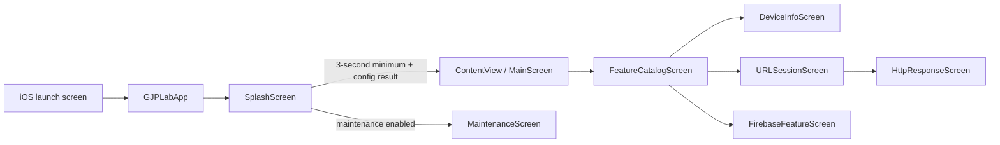
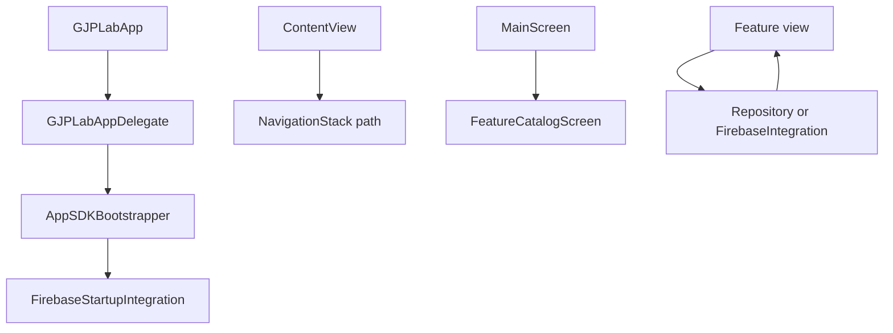

# Application architecture

Status: Implemented snapshot, 2026-08-30

## Purpose

GJPLab is a single-target iOS learning application. It favors small, readable feature slices over production-scale abstraction: SwiftUI renders the interface, `NavigationStack` owns the route path, feature views own small local state, repositories isolate data mechanics, and external SDK access stays in integration adapters.

## Runtime flow



[`GJPLabApp`](../../GJPLab/GJPLabApp.swift) is the SwiftUI entry point. It attaches [`GJPLabAppDelegate`](../../GJPLab/GJPLabAppDelegate.swift) for SDK lifecycle callbacks, coordinates splash timing and maintenance mode, then chooses the dashboard or maintenance screen. [`ContentView`](../../GJPLab/ContentView.swift) owns the dashboard route path.

## Code organization

| Path | Responsibility |
| --- | --- |
| `GJPLab/common/config/` | Stable application behavior constants |
| `GJPLab/common/model/` | Routes, dashboard catalogue models, and HTTP response types |
| `GJPLab/common/theme/` | Slate semantic colors, reusable surface treatment, and brand mark |
| `GJPLab/features/<feature>/` | Feature views and feature-specific data code |
| `GJPLab/features/catalog/` | Category catalogue presentation |
| `GJPLab/integration/` | SDK bootstrap and integration adapters |
| `GJPLab/integration/firebase/` | Firebase constants, startup, messaging, and service boundary |
| Root `GJPLab/*.swift` | App lifecycle, startup, dashboard, splash, and maintenance |

New code should follow the closest feature pattern. Reusable app behavior belongs in `common/`; SDK-specific behavior belongs under `integration/`.

## Dependency and event flow



- `GJPLabAppDelegate` owns process-level SDK callbacks and forwards them through `AppSDKBootstrapper`.
- `ContentView` owns navigation state using `[FeatureRoute]`.
- Views own private presentation state with `@State`; `FirebaseFeatureScreen` owns its observable Firebase service with `@StateObject`.
- `URLSessionRepository` performs request mechanics; views present state and invoke explicit actions.

## State and lifecycle model

The project intentionally uses SwiftUI-local state instead of a dedicated view-model layer. This keeps the lab readable but has limits:

- `@State` is view-lifetime state, not durable persistence or cross-screen shared state.
- App startup state lives in `GJPLabApp`; recreating the scene can repeat startup work.
- `NavigationStack` path is memory-backed and is not currently restored after termination.
- Feature state is intentionally isolated unless a requirement proves it must be shared.

Do not introduce a view model, coordinator, dependency container, domain layer, or module split as incidental refactoring. Add one only for a demonstrated requirement and include migration coverage.

## Platform and security boundaries

Push notification/APNs lifecycle callbacks reside in `GJPLabAppDelegate` and `integration/firebase/`. App capabilities are declared in `GJPLab.Debug.entitlements` and `GJPLab.Release.entitlements`; launch-screen configuration is generated from target build settings. Network behavior uses Apple transport security defaults—do not add exceptions or custom trust behavior merely to make a sample endpoint work.

Firebase client configuration in `GoogleService-Info.plist` is not server authority. Service accounts, APNs private keys, OAuth secrets, App Check debug tokens, and FCM server credentials must not enter the application or repository.

## Build and verification

The app target uses Swift 5, an iOS 26.4 deployment target, Xcode project file-system synchronized groups, and Firebase Apple SDK products through Swift Package Manager.

```bash
xcodebuild -project GJPLab.xcodeproj -scheme GJPLab -configuration Debug \
  -destination 'generic/platform=iOS Simulator' CODE_SIGNING_ALLOWED=NO build
```

Run the matching test command when a simulator runtime is available. Use a physical device for APNs, authorization prompts, and system lifecycle fidelity.

## Known architectural constraints

| Constraint | Consequence | Revisit when |
| --- | --- | --- |
| One app target | Fast discovery; weak compile-time feature boundaries | Build time or ownership becomes a problem |
| View-local state | Low ceremony; limited restoration and sharing guarantees | State must outlive a view or scene |
| In-memory navigation path | Clear small-app routing; no durable restoration | Deep links or restoration become product requirements |
| Firebase callbacks/adapters | Small API surface; limited result detail and cancellation | Callers need richer structured outcomes |
| Minimal automated tests | Fast experimentation; lower regression confidence | Behavior becomes important to preserve |

See [Slate design system](design-system.md), [splash technical design](../features/splash-screen.md), and [Firebase integration](../integrations/firebase.md) for feature-specific detail.
