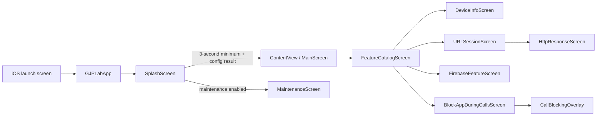
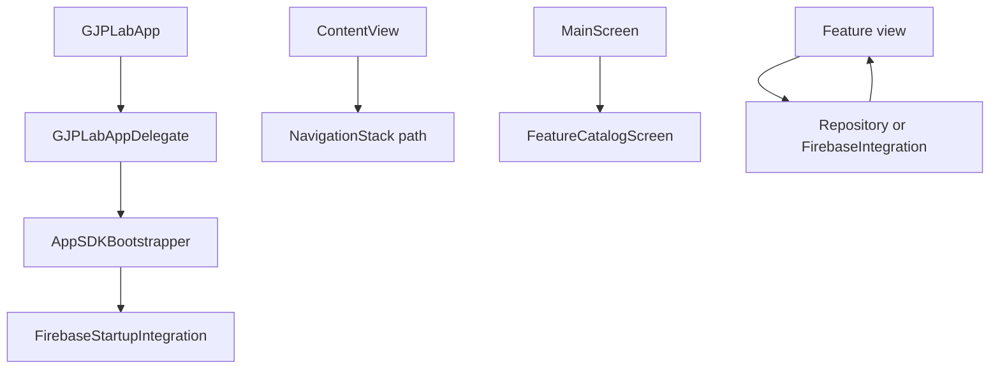

# Application architecture

Status: Implemented snapshot, 2026-09-27

## Purpose

GJPLab is a single-target iOS learning application. It favors small, readable feature slices over production-scale abstraction: SwiftUI renders the interface, `NavigationStack` owns the route path, feature views own small local state, repositories isolate data mechanics, and external SDK access stays in adapters under `sdk/`.

## Runtime flow


```mermaid
flowchart LR
    Launch[iOS launch screen] --> App[GJPLabApp]
    App --> Splash[SplashScreen]
    Splash -->|3-second minimum + config result| Dashboard[ContentView / MainScreen]
    Splash -->|maintenance enabled| Maintenance[MaintenanceScreen]
    Dashboard --> Catalog[FeatureCatalogScreen]
    Catalog --> Device[DeviceInfoScreen]
    Catalog --> HTTP[URLSessionScreen]
    Catalog --> Firebase[FirebaseFeatureScreen]
    HTTP --> Response[HttpResponseScreen]
    Catalog --> Calls[BlockAppDuringCallsScreen]
    Calls --> Overlay[CallBlockingOverlay]
```

[`GJPLabApp`](../../GJPLab/app/GJPLabApp.swift) is the SwiftUI entry point. It attaches [`GJPLabAppDelegate`](../../GJPLab/app/GJPLabAppDelegate.swift) for SDK lifecycle callbacks, coordinates splash timing and maintenance mode, then chooses the dashboard or maintenance screen. [`ContentView`](../../GJPLab/app/ContentView.swift) owns the dashboard route path.

## Code organization

| Path | Responsibility |
| --- | --- |
| `GJPLab/app/` | App entry point, app delegate, and the root `ContentView` that owns the route path |
| `GJPLab/app/startup/` | Splash and maintenance screens |
| `GJPLab/navigation/` | App-wide `FeatureRoute` values |
| `GJPLab/navigation/dashboard/` | Category dashboard (`MainScreen`) |
| `GJPLab/navigation/catalog/` | Category catalogue screen and catalogue models |
| `GJPLab/features/<category>/` | Category-level route and catalogue content, when a category needs them (e.g. `SecurityRoute`, `SecurityCatalog`) |
| `GJPLab/features/<category>/<feature>/` | Feature views and controllers, with `data/` and `model/` subfolders as needed |
| `GJPLab/sdk/` | SDK bootstrap and integration adapters |
| `GJPLab/sdk/firebase/` | Firebase constants, startup, messaging, and service boundary |
| `GJPLab/common/config/` | Stable application behavior constants |
| `GJPLab/common/theme/` | Slate semantic colors, reusable surface treatment, and brand mark |
| Root `GJPLab/` | Asset catalog, `GoogleService-Info.plist`, and Debug/Release entitlements only |

New code should follow the closest feature pattern. Reusable app behavior belongs in `common/`; SDK-specific behavior belongs under `sdk/`. Folder names are lowercase and do not repeat their parent (`httpclient/urlsession`, not `httpclient/httpurlsession`).

### Adding a feature

1. Start from the [feature requirement template](../requirements/FEATURE_REQUIREMENT_TEMPLATE.md); add a detailed design when the feature has lifecycle, persistence, integration, platform, or security behavior.
2. Add the screen under `features/<category>/<feature>/`, with `data/` and `model/` subfolders as needed.
3. Add a `FeatureRoute` case (or a case on the category's nested route, such as `SecurityRoute`) and its destination in `ContentView`.
4. Add or enable the catalogue entry in `DashboardCategory.items` or the category's `<Category>Catalog`.
5. Add previews (light, dark, and iPad where layout adapts), and a UI test when the feature is reachable from the dashboard.

## Dependency and event flow


```mermaid
flowchart TD
    App[GJPLabApp] --> Delegate[GJPLabAppDelegate]
    Delegate --> Bootstrapper[AppSDKBootstrapper]
    Bootstrapper --> FirebaseStartup[FirebaseStartupIntegration]
    Content[ContentView] --> Path[NavigationStack path]
    Main[MainScreen] --> Catalog[FeatureCatalogScreen]
    Feature[Feature view] --> Repository[Repository or FirebaseIntegration]
    Repository --> Feature
```

- `GJPLabAppDelegate` owns process-level SDK callbacks and forwards them through `AppSDKBootstrapper`.
- `ContentView` owns navigation state using `[FeatureRoute]`.
- Views own private presentation state with `@State`. `GJPLabApp` owns, with `@StateObject`, the `FirebaseIntegration` used for the splash maintenance lookup and the shared call-blocking controller; `FirebaseFeatureScreen` owns its own `FirebaseIntegration` for the lab screen.
- `URLSessionRepository` performs request mechanics; views present state and invoke explicit actions.

## State and lifecycle model

The project intentionally uses SwiftUI-local state instead of a dedicated view-model layer. This keeps the lab readable but has limits:

- `@State` is view-lifetime state, not durable persistence or cross-screen shared state.
- App startup state lives in `GJPLabApp`; recreating the scene can repeat startup work.
- `NavigationStack` path is memory-backed and is not currently restored after termination.
- Feature state is intentionally isolated unless a requirement proves it must be shared.

Do not introduce a view model, coordinator, dependency container, domain layer, or module split as incidental refactoring. Add one only for a demonstrated requirement and include migration coverage.

## Platform and security boundaries

Push notification/APNs lifecycle callbacks reside in `GJPLabAppDelegate` and `sdk/firebase/`. App capabilities are declared in `GJPLab.Debug.entitlements` and `GJPLab.Release.entitlements`; launch-screen configuration is generated from target build settings. Network behavior uses Apple transport security defaults—do not add exceptions or custom trust behavior merely to make a sample endpoint work.

Firebase client configuration in `GoogleService-Info.plist` is not server authority. Service accounts, APNs private keys, OAuth secrets, App Check debug tokens, and FCM server credentials must not enter the application or repository.

## Build and verification

| Setting | Value |
| --- | --- |
| Toolchain | Xcode 27.0 (iOS 27 SDK); Swift 5 language mode |
| Deployment target | iOS 26.6, set once at project level; no target overrides |
| Concurrency | `SWIFT_DEFAULT_ACTOR_ISOLATION = MainActor`, approachable concurrency enabled |
| Project model | File-system synchronized groups; Firebase Apple SDK through Swift Package Manager |
| Warning baseline | A clean build has zero warnings; keep it that way |

```bash
xcodebuild -project GJPLab.xcodeproj -scheme GJPLab -configuration Debug \
  -destination 'generic/platform=iOS Simulator' CODE_SIGNING_ALLOWED=NO build

DEVICE=$(.agent/skills/ios-build-release/scripts/pick-simulator.sh)
xcodebuild -project GJPLab.xcodeproj -scheme GJPLab \
  -destination "platform=iOS Simulator,name=$DEVICE" CODE_SIGNING_ALLOWED=NO \
  -only-testing:GJPLabTests test
```

Drop `-only-testing` to include UI tests. Use a physical device for APNs, authorization prompts, CallKit, and system lifecycle fidelity.

## Known architectural constraints

| Constraint | Consequence | Revisit when |
| --- | --- | --- |
| One app target | Fast discovery; weak compile-time feature boundaries | Build time or ownership becomes a problem |
| View-local state | Low ceremony; limited restoration and sharing guarantees | State must outlive a view or scene |
| In-memory navigation path | Clear small-app routing; no durable restoration | Deep links or restoration become product requirements |
| Firebase callbacks/adapters | Small API surface; limited result detail and cancellation | Callers need richer structured outcomes |
| Minimal automated tests (call-blocking controller only) | Fast experimentation; startup, networking, and Firebase paths are unguarded | Behavior becomes important to preserve |

See [Slate design system](design-system.md), [splash detailed design](../detail-design/splash-screen.md), [call-blocking detailed design](../detail-design/security/block_app_during_calls.md), and [Firebase integration](../integrations/firebase.md) for feature-specific detail.
