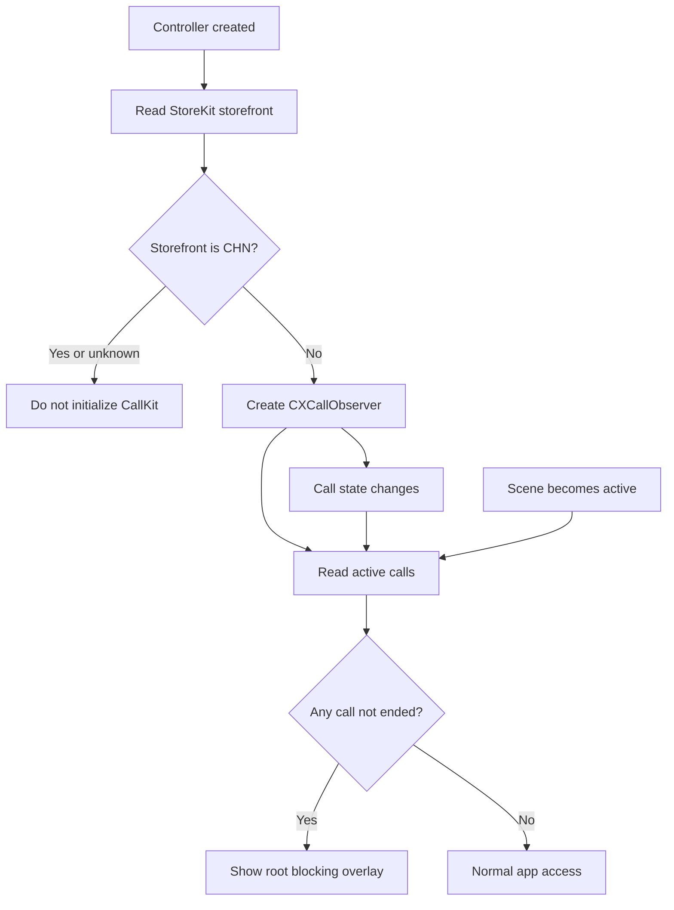

# Block App During Calls detailed design

Status: Implemented

Requirements: [Block App During Calls](../../requirements/security/block_app_during_calls.md)

## Implementation goal

Prevent interaction with GJP Lab while iOS reports an active call, while preserving normal access when the setting is disabled, a call ends, or CallKit must not be used for the current App Store storefront.

## Source map

| Source | Responsibility |
| --- | --- |
| [`BlockAppDuringCallsController.swift`](../../../GJPLab/features/security/blockappduringcalls/BlockAppDuringCallsController.swift) | Persistent preference, storefront gate, CallKit observer, call state, and simulated-call state |
| [`BlockAppDuringCallsScreen.swift`](../../../GJPLab/features/security/blockappduringcalls/BlockAppDuringCallsScreen.swift) | Settings/status/test UI and full-screen blocking overlay |
| [`SecurityCatalog.swift`](../../../GJPLab/features/security/model/SecurityCatalog.swift) | Security catalogue entry for the feature |
| [`SecurityRoute.swift`](../../../GJPLab/features/security/model/SecurityRoute.swift) | Security-specific navigation value |
| [`FeatureRoute.swift`](../../../GJPLab/navigation/FeatureRoute.swift) | App-level route wrapper for Security routes |
| [`ContentView.swift`](../../../GJPLab/ContentView.swift) | Security-route destination in the app-owned navigation stack |
| [`GJPLabApp.swift`](../../../GJPLab/GJPLabApp.swift) | Long-lived controller, active-scene refresh, and app-wide overlay |

## Ownership and state

`GJPLabApp` creates and retains one `BlockAppDuringCallsController` with `@StateObject`. This lifetime keeps observation independent of the settings screen and allows the root overlay to react while any route is displayed.

| State | Owner | Persistence | Meaning |
| --- | --- | --- | --- |
| `isEnabled` | Controller | `UserDefaults` | User preference; defaults to the app configuration value, currently on |
| `availability` | Controller | None | Checking, available, unavailable in China, or unavailable when storefront lookup has no value |
| `hasActiveCall` | Controller | None | Current public CallKit observer state |
| `isTestCallActive` | Controller | None | Screen-only verification state |
| `isBlocking` | Controller | Derived | True only when enabled, available, and a real or simulated call is active |

## Runtime flow

`ContentView` remains the only `NavigationStack` owner. The Security catalogue creates `.security(.blockAppDuringCalls)`, and `ContentView` renders the settings screen for that route. The root overlay is intentionally outside navigation so it blocks every feature and does not add a dismissible route.

## China App Store behavior

The controller reads `Storefront.current` before constructing `CXCallObserver`. For storefront country code `CHN`, it publishes `unavailableInChina`, disables the setting UI, and does not initialize CallKit. A missing storefront also fails closed as unavailable so the app never creates CallKit before the regional gate can be evaluated.

This implementation does not guarantee App Review approval. Release review must validate the final binary and China-specific availability requirements. Do not replace the storefront gate with device locale, a hidden setting, or a private API.

## User interface and test path

The destination screen contains:

- a persisted system toggle;
- feature and current-call status text;
- a simulated active-call control, available only when monitoring is available and enabled; and
- an explicit limitation explaining that iOS can only report calls it exposes through CallKit.

The test control updates `isTestCallActive`, exercising the same derived `isBlocking` condition as a real call. The app-wide overlay contains no bypass action; ending the real or simulated call restores access automatically.

## Limitations and safeguards

- `CXCallObserver` can observe only system-exposed call activity; third-party apps that do not report their calls through iOS cannot be detected.
- The feature stores only the Boolean preference. It does not log, persist, or display call handles, phone numbers, or call metadata.
- A Storefront lookup failure disables the feature rather than risking CallKit initialization for a China storefront. This may make the feature temporarily unavailable outside China.

## Verification

- Unit tests cover blocking when enabled with a simulated call and the China storefront gate.
- Build all app and test targets with the project build command.
- On a physical non-China storefront device, test outgoing/incoming system-exposed calls, foreground return, setting persistence, and the simulated-call path.
- On a China storefront test account, confirm CallKit is never initialized and the settings page reports unavailable.
