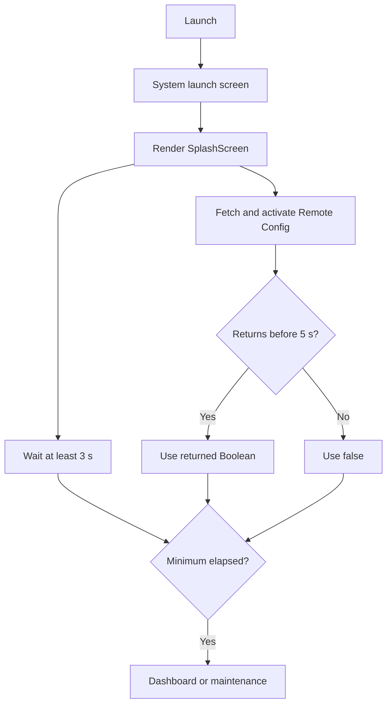

# Splash screen technical design

Status: Partial implementation

Requirements: [Splash screen requirements](../requirements/splash-screen.md)

## Current design

[`GJPLabApp`](../../GJPLab/GJPLabApp.swift) owns startup coordination. It renders the stateless [`SplashScreen`](../../GJPLab/SplashScreen.swift), starts a Remote Config lookup and a three-second minimum timer concurrently, then displays the dashboard or maintenance screen based on whichever maintenance result wins the five-second task-group race.



## Source map

| Source | Responsibility |
| --- | --- |
| [`GJPLabApp.swift`](../../GJPLab/GJPLabApp.swift) | App-owned splash timer, Remote Config timeout race, and destination selection |
| [`SplashScreen.swift`](../../GJPLab/SplashScreen.swift) | Brand presentation only |
| [`AppConfig.swift`](../../GJPLab/common/config/AppConfig.swift) | Three-second minimum and five-second timeout |
| [`FirebaseIntegration.swift`](../../GJPLab/integration/firebase/FirebaseIntegration.swift) | Fetches/activates Remote Config and returns maintenance Boolean |
| [`MaintenanceScreen.swift`](../../GJPLab/MaintenanceScreen.swift) | Maintenance retry presentation |
| [`LabTheme.swift`](../../GJPLab/common/theme/LabTheme.swift) | Semantic light/dark roles |

## Coordination model

The app task starts `loadMaintenanceMode()` and the three-second sleep in parallel. `loadMaintenanceMode()` races Firebase retrieval against a five-second sleep with a task group, accepts the first result, cancels the losing task, and falls back to `false` for timeout or failure. The root state changes from `showingSplash` to `maintenanceEnabled`/dashboard only after both the fetch task and minimum duration complete.

Task cancellation stops the local timeout task but cannot guarantee cancellation of an underlying Firebase SDK operation. A late SDK result cannot mutate the root destination because the task group has already returned.

## Requirement status

| Requirement area | Status | Evidence or gap |
| --- | --- | --- |
| System launch alignment | Implemented | Appearance-aware `LaunchBackground` and `LaunchMark` assets |
| Cold-launch splash and destination | Implemented | Root `showingSplash` state in `GJPLabApp` |
| 3-second minimum and 5-second timeout | Implemented | `AppConfig` and task group |
| First result wins within one app task | Implemented | `group.next()` followed by `cancelAll()` |
| Maintenance destination and retry | Implemented | `MaintenanceScreen` callback refetches Remote Config |
| Usable-network precheck/offline skip | Planned | Current app lets Firebase fail rather than checking `NWPathMonitor` first |
| Explicit progress semantics | Planned | Splash currently presents only mark and name |
| Warm-resume policy | Partial | Root state normally persists, but scene recreation behavior is not specified |
| Deterministic startup tests | Planned | Timer/Firebase coordination is coupled to `GJPLabApp` and real time |
| Reduced-motion behavior | Implemented by absence | No decorative animation is present |

## Test strategy

The highest-value seam is a small startup coordinator with injected maintenance loader and clock/sleeper. Extract it only when tests or scene-restoration requirements justify the new boundary.

Recommended coverage:

- unit tests: both gate orders, timeout, failure, cancellation, and exactly-once decision;
- UI tests: splash/maintenance/dashboard selection, Dynamic Type, and light/dark presentation;
- device checks: cold launch, offline path once added, delayed Firebase response, and scene lifecycle;
- manual review: launch-screen handoff and VoiceOver progress semantics.

## Verification

```bash
xcodebuild -project GJPLab.xcodeproj -scheme GJPLab -configuration Debug \
  -destination 'generic/platform=iOS Simulator' CODE_SIGNING_ALLOWED=NO build
```

The simulator/device checks are conditional on an available runtime and Firebase configuration. Tests must not depend exclusively on live Remote Config state.
