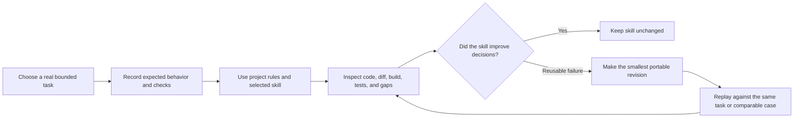

# iOS agent skills practice

Status: Active learning workflow

## Purpose

This repository is the practice host for a portable iOS skill library under [`.agent/skills/`](../../.agent/skills/). The skills help coding agents discover an unfamiliar Swift project, choose a focused workflow, respect local architecture, and verify outcomes. They are not a second copy of project rules.

[`AGENTS.md`](../../AGENTS.md) is the project contract and skill router. [`CLAUDE.md`](../../CLAUDE.md) imports that contract for Claude Code. Agents without automatic discovery can follow the linked `SKILL.md` entry points.

## Skill map

| Skill | Practice concern | Representative GJPLab task |
| --- | --- | --- |
| [`ios-swiftui-design`](../../.agent/skills/ios-swiftui-design/SKILL.md) | SwiftUI, accessibility, adaptive layout, previews | Bring a splash or dashboard state into visual-system alignment |
| [`ios-feature-architecture`](../../.agent/skills/ios-feature-architecture/SKILL.md) | State ownership, navigation, lifecycle, dependency wiring | Extract startup coordination only when deterministic tests require it |
| [`ios-data-concurrency`](../../.agent/skills/ios-data-concurrency/SKILL.md) | Repositories, URLSession, actors, persistence, synchronization | Review `URLSessionRepository` cancellation and response contract |
| [`ios-platform-privacy`](../../.agent/skills/ios-platform-privacy/SKILL.md) | Permissions, entitlements, notifications, background work, privacy | Improve notification authorization timing and token handling |
| [`ios-quality-build`](../../.agent/skills/ios-quality-build/SKILL.md) | Diagnosis, XCTest, Xcode, CI, performance, release checks | Add deterministic splash race tests and choose proportionate verification |

## Practice loop

## Evidence-based refinement

Before using a skill, record the user outcome, source files, expected artifacts, checks, and risks. Evaluate routing, discovery, scope, correctness, verification, portability, and context efficiency from evidence—not confidence or prose style.

Revise a portable skill only for a failure likely to recur across iOS projects. Put local facts such as `NavigationStack`, Firebase paths, build commands, deployment target, and app identifiers in `AGENTS.md`, not a portable skill. Prefer a narrow correction to accumulating universal rules.

## Skill quality checklist

- Folder name and frontmatter `name` match and use lowercase hyphens.
- Description says what the skill does, when it applies, and an exclusion.
- Entrypoint includes shared decisions and routes substantial modes to focused references.
- References are direct and conditionally loaded.
- Instructions preserve user intent and authorization boundaries.
- Completion criteria are observable and proportional to risk.
- No local workaround, duplicate project rule, placeholder, or hidden dependency remains.
- The skill has been exercised on at least one realistic task before expansion.

Record practice outcomes in the issue, pull request, or task that performed the work; do not create a permanent evidence log for every run.
