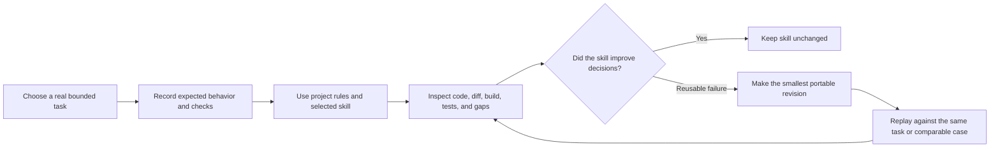

# iOS agent skills practice

Status: Active learning workflow

## Purpose

This repository is the practice host for a portable iOS skill library under [`.agent/skills/`](../../.agent/skills/). The skills help coding agents discover an unfamiliar Swift project, choose a focused workflow, respect local architecture, and verify outcomes. They are not a second copy of project rules.

[`AGENTS.md`](../../AGENTS.md) is the project contract and skill router. Claude Code (v2.1.277+), Codex, and other agents read it directly; there is no `CLAUDE.md`, because adding one would make Claude Code read it instead of `AGENTS.md`. Agents without automatic discovery can follow the linked `SKILL.md` entry points. `.claude/skills` is a symlink to `.agent/skills`, so Claude Code discovers the same files; keep skills in `.agent/skills/` only. The general-purpose `commit-push` skill lives alongside the iOS skills but is not part of the iOS library.

## Skill map

| Skill | Practice concern | Representative GJPLab task |
| --- | --- | --- |
| [`ios-api-availability`](../../.agent/skills/ios-api-availability/SKILL.md) | Deployment target, `#available`, deprecations, SDK upgrades | Replace `UIScreen.main` after the iOS 26 SDK deprecation |
| [`ios-architecture`](../../.agent/skills/ios-architecture/SKILL.md) | State ownership, navigation, lifecycle, dependency wiring, modularization | Extract startup coordination only when deterministic tests require it |
| [`ios-swiftui-patterns`](../../.agent/skills/ios-swiftui-patterns/SKILL.md) | SwiftUI, accessibility, localization, adaptive layout, UIKit interop, previews | Bring a splash or dashboard state into visual-system alignment |
| [`swift-concurrency`](../../.agent/skills/swift-concurrency/SKILL.md) | Actors, isolation, cancellation, Sendable, Swift 6 migration | Remove the redundant `await` in `BlockAppDuringCallsController` |
| [`ios-data-layer`](../../.agent/skills/ios-data-layer/SKILL.md) | Repositories, URLSession, persistence, caching, synchronization | Review `URLSessionRepository` cancellation and response contract |
| [`ios-testing`](../../.agent/skills/ios-testing/SKILL.md) | Swift Testing, XCTest, XCUITest, test doubles, flaky tests | Add deterministic splash race tests |
| [`ios-build-release`](../../.agent/skills/ios-build-release/SKILL.md) | xcodebuild, diagnosis, simulator hangs, SPM, CI, release checks | Restore a clean zero-warning build under a new Xcode |
| [`ios-platform-privacy`](../../.agent/skills/ios-platform-privacy/SKILL.md) | Permissions, entitlements, notifications, background work, privacy | Improve notification authorization timing and token handling |

## Practice loop

```mermaid
flowchart LR
    Task[Choose a real bounded task] --> Baseline[Record expected behavior and checks]
    Baseline --> Run[Use project rules and selected skill]
    Run --> Evidence[Inspect code, diff, build, tests, and gaps]
    Evidence --> Evaluate{Did the skill improve decisions?}
    Evaluate -->|Yes| Keep[Keep skill unchanged]
    Evaluate -->|Reusable failure| Refine[Make the smallest portable revision]
    Refine --> Replay[Replay against the same task or comparable case]
    Replay --> Evidence
```

## Evidence-based refinement

Before using a skill, record the user outcome, source files, expected artifacts, checks, and risks. Evaluate routing, discovery, scope, correctness, verification, portability, and context efficiency from evidence—not confidence or prose style.

Revise a portable skill only for a failure likely to recur across iOS projects. Put local facts such as `NavigationStack`, Firebase paths, build commands, deployment target, and app identifiers in `AGENTS.md`, not a portable skill. Prefer a narrow correction to accumulating universal rules.

## Skill quality checklist

- Folder name and frontmatter `name` match and use lowercase hyphens.
- Description says what the skill does, when it applies (including words users actually type, such as "build failed" or "Face ID"), and an exclusion. Quote it when it contains ` #` or `: `, which YAML would otherwise treat as a comment or a key.
- Entrypoint follows one shape: purpose, "Pairs with", discovery, mode routing, Gotchas, completion contract; it stays under about 45 lines.
- Gotchas are concrete, current pitfalls the model is likely to get wrong, not general principles it already knows.
- References are direct and conditionally loaded; review references are `- [ ]` checklists.
- Bundled scripts are deterministic, time out instead of hanging, and print a recovery hint on failure.
- `metadata.version` is bumped whenever a skill's behavior changes.
- Instructions preserve user intent and authorization boundaries.
- Completion criteria are observable and proportional to risk.
- No local workaround, duplicate project rule, placeholder, or hidden dependency remains.
- The skill has been exercised on at least one realistic task before expansion.

Record practice outcomes in the issue, pull request, or task that performed the work; do not create a permanent evidence log for every run.
