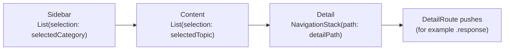

# Category sidebar detailed design

Status: Implemented

Requirements: [Category sidebar](sidebar_requirement.md)

## Implementation goal

Use one `NavigationSplitView` for every device: three columns on regular widths, collapsing automatically into a stack on compact widths, driven entirely by selection state.

## Source map

| Source | Responsibility |
| --- | --- |
| [`ContentView.swift`](../../../../GJPLab/app/ContentView.swift) | Owns the split view, `selectedCategory`, `selectedTopic`, and `detailPath`; renders feature destinations |
| [`CategorySidebar.swift`](../../../../GJPLab/app/navigation/CategorySidebar.swift) | Sidebar list and category rows |
| [`FeatureCatalogScreen.swift`](../../../../GJPLab/app/navigation/FeatureCatalogScreen.swift) | Content column: topic list with selection |
| [`FeatureRoute.swift`](../../../../GJPLab/app/navigation/FeatureRoute.swift) | `FeatureRoute` (topic selection) and `DetailRoute` (pushes inside the feature column) |
| [`navigation.json`](../../../../GJPLab/app/navigation/navigation.json) | Category order, text, icons, and topics |
| [`NavigationMenu.swift`](../../../../GJPLab/app/navigation/NavigationMenu.swift) | `NavigationMenu.main` decodes the JSON |

## Navigation model

| State | Type | Owner | Reset when |
| --- | --- | --- | --- |
| `selectedCategory` | `NavigationCategory?` | `ContentView` | User goes back to the sidebar (compact) |
| `selectedTopic` | `FeatureRoute?` | `ContentView` | `selectedCategory` changes |
| `detailPath` | `[DetailRoute]` | `ContentView` | `selectedTopic` changes |

Selection, not pushed values, drives the first two levels. That is what lets the system collapse the columns on iPhone (selecting a row pushes the next column; back clears the selection) and keep them side by side on iPad. Screens inside a feature that need to push further (such as the URLSession response) append a `DetailRoute` to `detailPath`.

Only available topics are tagged in the catalogue list, so planned topics cannot become the selection.

## Rows

Each sidebar row is its own card (`.labListCard(isSelected:)`): the category icon in a 44-point `primaryContainer` tile, the title, and the description in `onSurfaceVariant`. The row is one accessibility element with the hint "Opens the <category> catalogue". The list is `.plain` with `.scrollContentBackground(.hidden)` and `.labScreenBackground()`, so the cards sit on the same Slate canvas as every other screen. The card hides the system selection highlight, so the selected category (visible on iPad) gets a 1-point `primary` border instead of the 0.5-point `outlineVariant` one.

## Replaced design

This replaces the earlier card-grid dashboard (`MainScreen`) that pushed `.catalog(category)` onto a single `NavigationStack`. The grid used 2, 3, or 5 columns by width, left most of an iPad screen unused after the first tap, and truncated card text at large Dynamic Type sizes.

## Known gaps

| Gap | Effect | Suggested fix |
| --- | --- | --- |
| No search across topics | Finding a topic means browsing categories | Add `.searchable` over all available topics |
| Selection is not restored after relaunch | The app always starts at the sidebar | Store the selected category and topic (both `Hashable`; make them `Codable`) |
| No deep links | Topics cannot be opened from a URL | Map URLs to `selectedCategory` and `selectedTopic` at one boundary |
| UI tests run on iPhone only | Collapsing and back navigation are covered on iPhone (opening every Swift and SwiftUI topic and going back); the three-column iPad layout is unguarded | Run the `UI` test plan on an iPad simulator too |

## Verification

- Previews: `CategorySidebar` and `ContentView`, each in light and dark. Check iPad by switching the canvas device; there is no separate iPad preview.
- Automated: `SwiftTopicsUITests.testSwiftIsTheFirstCategory` checks the category order; the topic UI tests open categories and go back on iPhone.
- Manual: SDB-AC-01 to SDB-AC-05 on an iPhone simulator and an iPad simulator in both orientations; VoiceOver and a large Dynamic Type size.
