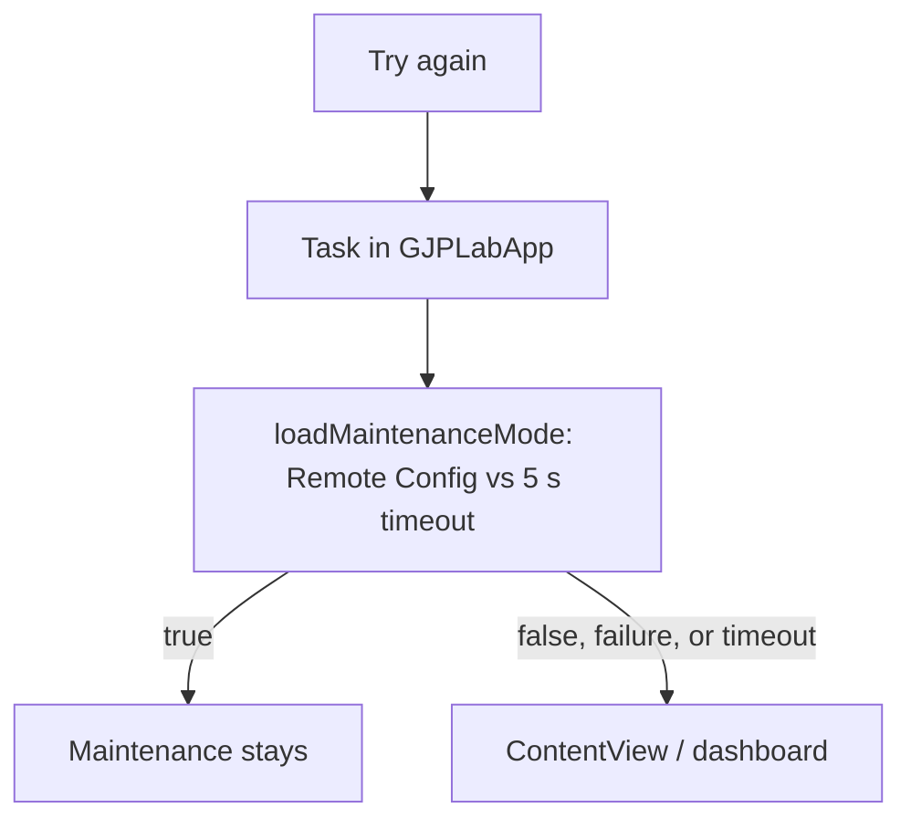

# Maintenance detailed design

Status: Implemented, with known gaps

Requirements: [Maintenance](maintenance_requirement.md)

## Implementation goal

Show a blocking maintenance message when the remote flag is enabled, and let the user re-check the flag without restarting the app.

## Source map

| Source | Responsibility |
| --- | --- |
| [`MaintenanceScreen.swift`](../../../../GJPLab/app/startup/MaintenanceScreen.swift) | Stateless presentation; reports taps through `onRetry` |
| [`GJPLabApp.swift`](../../../../GJPLab/app/GJPLabApp.swift) | Owns `maintenanceEnabled`, chooses the screen, and runs `loadMaintenanceMode()` on retry |
| [`FirebaseIntegration.swift`](../../../../GJPLab/features/integration/firebase/FirebaseIntegration.swift) | `fetchMaintenanceMode()`: fetch-and-activate, return the flag, or `false` on failure |
| [`FirebaseStartupIntegration.swift`](../../../../GJPLab/features/integration/firebase/FirebaseStartupIntegration.swift) | Remote Config default (`false`) and fetch interval (0 in Debug, 3600 s in Release) |
| [`AppConfig.swift`](../../../../GJPLab/common/config/AppConfig.swift) | 5-second `remoteConfigTimeout` |

## Ownership and flow

`MaintenanceScreen` holds no state. `GJPLabApp` owns `maintenanceEnabled` as `@State` and renders the maintenance screen instead of `ContentView` while it is `true`, so there is no navigation stack and no back action.

Retry reuses the startup race without the 3-second splash minimum, so the dashboard can appear as soon as the result arrives.

## Known gaps

| Gap | Effect | Suggested fix |
| --- | --- | --- |
| No progress state during retry | Up to 5 seconds without feedback after tapping | Show a progress indicator and disable the button while retrying |
| Repeated taps start overlapping requests | Several tasks race; the last to finish decides the screen | Keep one retry task and ignore taps while it runs |
| Release fetch interval is one hour | A cached `true` can keep users blocked after maintenance ends | Use a shorter interval for this key, or Remote Config real-time updates |
| Failure fails open | Users enter the app during maintenance when the network is poor | Accepted by the splash requirement; revisit if maintenance must be strict |
| Flag checked only at startup and on retry | Turning maintenance on does not affect running sessions | Add real-time updates or a foreground check if required |
| Icon has no explicit accessibility treatment | VoiceOver may announce the decorative wrench icon | Hide the icon from accessibility |
| No automated tests | Retry and fail-open behavior are unguarded | Test through a startup coordinator with an injected loader (see the splash detailed design) |

## Verification

- Preview: `MaintenanceScreen` in light and dark appearance.
- Manual, Debug build: set `gjp_lab_maintenance_enabled` to `true` in the Firebase console, launch, confirm MNT-AC-01; set it to `false`, tap **Try again**, confirm MNT-AC-02. Repeat in airplane mode for MNT-AC-04.
- Check a large Dynamic Type size and iPad width.
