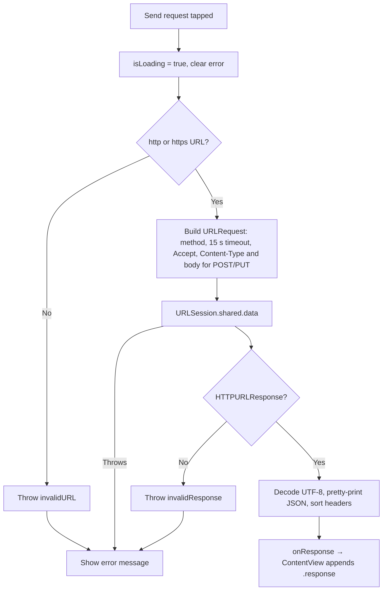

# URLSession detailed design

Status: Implemented, with known gaps

Requirements: [URLSession](urlsession_requirement.md)

## Implementation goal

Show the smallest complete `URLSession` round trip: build a `URLRequest` from user input, send it with async/await, and present the status, body, and headers, while keeping request mechanics out of the views.

## Source map

| Source | Responsibility |
| --- | --- |
| [`URLSessionScreen.swift`](../../../../../GJPLab/features/httpclient/urlsession/URLSessionScreen.swift) | Request form, loading and error state, send action |
| [`HttpResponseScreen.swift`](../../../../../GJPLab/features/httpclient/urlsession/HttpResponseScreen.swift) | Status, body, and header presentation |
| [`URLSessionRepository.swift`](../../../../../GJPLab/features/httpclient/urlsession/URLSessionRepository.swift) | URL validation, request construction, 15-second timeout, JSON formatting, header sorting, logging |
| [`HttpMethod.swift`](../../../../../GJPLab/features/httpclient/urlsession/HttpMethod.swift) | Supported methods and which ones carry a payload |
| [`HttpResponse.swift`](../../../../../GJPLab/features/httpclient/urlsession/HttpResponse.swift) | Hashable response value carried in the navigation route |
| [`FeatureRoute.swift`](../../../../../GJPLab/navigation/FeatureRoute.swift) | `FeatureRoute.urlSession` topic and `DetailRoute.response(HttpResponse)` push |
| [`ContentView.swift`](../../../../../GJPLab/app/ContentView.swift) | Shows `URLSessionScreen` in the detail column; appends `.response` to the feature-column path when a request completes |
| [`DashboardCategory.swift`](../../../../../GJPLab/navigation/catalog/DashboardCategory.swift) | HTTP Client catalogue entry |

## Ownership and state

| State | Owner | Lifetime | Meaning |
| --- | --- | --- | --- |
| `method`, `url`, `payload` | `URLSessionScreen` (`@State`) | Screen | Current request input |
| `isLoading` | `URLSessionScreen` (`@State`) | Screen | A request is in flight |
| `errorMessage` | `URLSessionScreen` (`@State`) | Screen | Last failure, cleared on send, dismiss, or method change |
| `HttpResponse` | Navigation path | Route | Completed response shown by `HttpResponseScreen` |

The screen does not own navigation. It reports a completed response through its `onResponse` closure, and `ContentView` appends `.response(response)` to the feature column's path. It ignores the response if the user has already selected another topic.

## Request flow

`URLSession` does not throw for 4xx or 5xx, so every HTTP status reaches the response screen; `HttpResponseScreen` colors 2xx as success and 4xx–5xx as error.

## Privacy and security

- Logging uses `os.Logger` with only the method (public), status code, and byte count. URLs, payloads, bodies, and headers are never logged.
- Transport uses Apple ATS defaults with no exceptions; plain `http://` requests to most hosts fail with a system error.
- The default URL calls the author's public API; the lab sends no credentials.

## Known gaps

| Gap | Effect | Suggested fix |
| --- | --- | --- |
| The send `Task` is not owned by the view | Leaving the screen does not cancel the request (a late response is dropped only if another topic is selected) | Store the task and cancel it on disappear, or drive sending from `.task(id:)` |
| Formatting runs on the main actor | Default main-actor isolation makes `URLSessionRepository` main-actor bound, so large bodies are decoded and pretty-printed on the main thread | Mark the repository or its formatting `nonisolated`/`@concurrent` |
| Non-UTF-8 bodies become an empty string | The response screen shows "(empty response)" for binary or other encodings | Show the byte count and content type instead |
| Payload is not validated as JSON | Invalid JSON is sent as-is | Validate before sending, or label the field as raw text |
| Full response is stored in the navigation route | Very large bodies are held in the path and hashed | Keep the path value small (for example, an ID) if large responses matter |
| No automated tests | Validation, headers, and formatting are unguarded | Unit-test `URLSessionRepository` with a per-test `URLProtocol` stub |

## Verification

- Build with the project build command in [application architecture](../../../../architecture/application.md#build-and-verification).
- Manual: run acceptance criteria URL-AC-01 to URL-AC-07 on a simulator, including airplane mode for URL-AC-06.
- Check light and dark appearance, a large Dynamic Type size, and iPad width on both screens.
