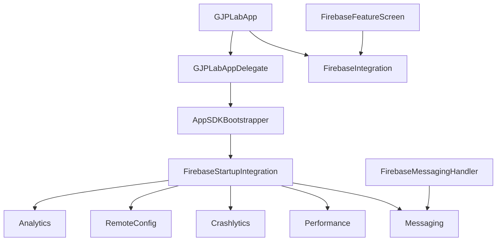

# Firebase detailed design

Status: Implemented, with known gaps

Requirements: [Firebase lab](firebase_requirement.md)

## Scope

GJPLab connects application ID `com.ganjianping.lab.is` to Firebase Analytics, Remote Config, Crashlytics, Performance Monitoring, and Cloud Messaging. It is intentionally small and demonstrative, not a production observability or security blueprint.

## Architecture

`GJPLabAppDelegate` delegates process-level setup to `AppSDKBootstrapper` in `app/`, which starts each registered SDK. `FirebaseStartupIntegration` configures Firebase once, while `FirebaseIntegration` is the screen-facing service boundary. `FirebaseMessagingHandler` owns Messaging and foreground-notification delegate callbacks.

## Build configuration

| Concern | Source of truth |
| --- | --- |
| Firebase client configuration | [`GoogleService-Info.plist`](../../../../../GJPLab/GoogleService-Info.plist) |
| Firebase package pin | [`Package.resolved`](../../../../../GJPLab.xcodeproj/project.xcworkspace/xcshareddata/swiftpm/Package.resolved) |
| Swift packages / linker flags | [`project.pbxproj`](../../../../../GJPLab.xcodeproj/project.pbxproj) |
| Push entitlement | [`GJPLab.Debug.entitlements`](../../../../../GJPLab/GJPLab.Debug.entitlements) and release counterpart |

Do not copy package versions into this guide; inspect the resolved package when exact versions matter.

## Stable contracts

[`FirebaseConstants`](../../../../../GJPLab/features/integration/firebase/FirebaseConstants.swift) owns names that must remain stable across app code and Firebase configuration:

| Service | Contract |
| --- | --- |
| Analytics | `app_started`, `feature_firebase_opened` |
| Crashlytics | `app_version`, `firebase_demo` |
| Remote Config | `gjp_lab_maintenance_enabled` |
| Performance | `firebase_demo_trace` |
| Messaging | Topic `gjp_lab_demo` |

Renaming one of these values is an integration change and must update configuration, tests, and documentation together.

## Service behavior

### Analytics

Startup logs `app_started`; the Firebase screen logs `feature_firebase_opened`. Do not add credentials, full identifiers, or personal information as event parameters.

### Remote Config

Startup sets a zero debug fetch interval, one-hour release interval, and `gjp_lab_maintenance_enabled = false` local default. `fetchMaintenanceMode()` calls `fetchAndActivate()` and returns the current Boolean. It does not distinguish a fresh value, cached value, or failed fetch with an active/default value; [the splash detailed design](../../../app/startup/splash_detail_design.md) documents the resulting fallback behavior.

### Crashlytics

Startup records the app version under `app_version`. The Firebase lab can write a non-sensitive log, set `firebase_demo = true`, and record a non-fatal `NSError`; it does not deliberately crash the app. Production symbolication needs the Firebase Crashlytics dSYM upload build phase.

### Performance Monitoring

Firebase Performance automatically collects supported app, rendering, and network metrics after configuration. The lab also records a short `firebase_demo_trace`; all real traces must stop on every completion path. Use `-FIRDebugEnabled` for SDK collection diagnosis.

### Cloud Messaging

Startup configures the Messaging delegate, requests notification authorization, registers APNs after authorization, and assigns the APNs token to Firebase Messaging. The feature screen can fetch the FCM token and subscribe to `gjp_lab_demo`.

In UI-testing mode (`AppConfig.isUITesting`, set by the UI tests' `-ui-testing` launch argument) `AppSDKBootstrapper` does not start `FirebaseStartupIntegration`, so Firebase is never configured, Remote Config is never fetched, and no notification prompt appears.

For physical-device delivery, enable Push Notifications, upload an APNs key/certificate in Firebase Console, and grant notification authorization. Do not put sending credentials, service accounts, or APNs private keys in the app.

## Lab screen

The Firebase feature exposes controlled actions for Analytics, non-fatal Crashlytics, Remote Config, a custom performance trace, FCM token retrieval/copying, and demo-topic subscription. These are learning/setup controls, not production user-facing behavior. When Firebase is not started (previews and UI-testing mode), `FirebaseIntegration.isConfigured` is false: the screen shows a notice and disables every action, because Firebase calls before `FirebaseApp.configure()` crash.

## Privacy and security notes

- `GoogleService-Info.plist` is client configuration, not server authority; protect Firebase resources with service-specific controls.
- The implementation logs only the FCM-token length on refresh, but the lab screen can retrieve and copy the full token. Clipboard exposure is demo-only behavior.
- Push payloads must not include secrets or sensitive personal data.
- Service accounts, server keys, OAuth secrets, APNs private keys, and App Check debug tokens must remain outside version control.

## Verification

- Build with the project build command in [application architecture](../../../../architecture/application.md#build-and-verification).
- Automated: none; tests never start Firebase. UI tests run in UI-testing mode, where this screen's actions are disabled.
- Manual: FB-AC-01 to FB-AC-08. Runtime checks should cover Analytics DebugView, enabled/disabled/failed Remote Config, non-fatal Crashlytics delivery, custom trace upload, notification grant/denial, and FCM token/topic behavior. APNs delivery needs a configured physical device. Firebase console data can be delayed.

## Known gaps

| Gap | Effect | Suggested fix |
| --- | --- | --- |
| Remote Config API returns only a Boolean | Callers cannot distinguish a fresh, cached, default, or failed value | Return a small result type with the value and its source |
| Notification permission is requested at launch | The system prompt appears before the user has a reason to allow it, against Apple's guidance | Request it from a button on the Firebase screen (a product decision) |
| `subscribeToDemoTopic()` starts an unstructured `Task` | It keeps running after the screen closes and is not awaited like the other actions | Make it `async` and call it from the button's `Task`, like the other actions |
| The demo trace is timed with `Date()` | Wall-clock time can jump; this is not how durations should be measured | Use `ContinuousClock` |
| `FirebaseIntegration` packs several statements per line with `;` | Harder to read for learners | Reformat to one statement per line |
| No Firebase emulator-backed tests | Integration confidence depends on manual and device checks | Add tests against the Firebase Local Emulator Suite if confidence becomes important |
| No Crashlytics dSYM upload phase in the build | Release crash stacks may not symbolicate | Add the Crashlytics run script build phase |

## Official references

- [Add Firebase to Apple projects](https://firebase.google.com/docs/ios/setup)
- [Analytics events](https://firebase.google.com/docs/analytics/ios/events)
- [Crashlytics](https://firebase.google.com/docs/crashlytics/ios/get-started)
- [Remote Config](https://firebase.google.com/docs/remote-config/ios/get-started)
- [Performance Monitoring](https://firebase.google.com/docs/perf-mon/get-started-ios)
- [Cloud Messaging](https://firebase.google.com/docs/cloud-messaging/ios/client)
